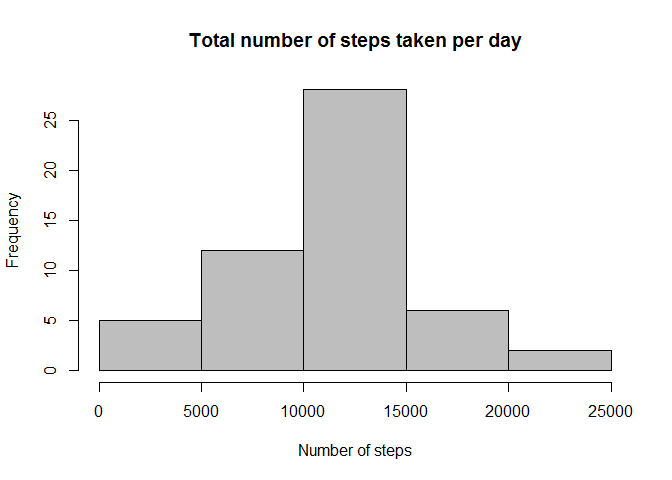
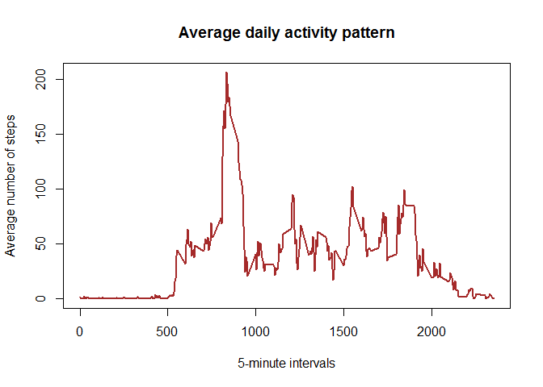
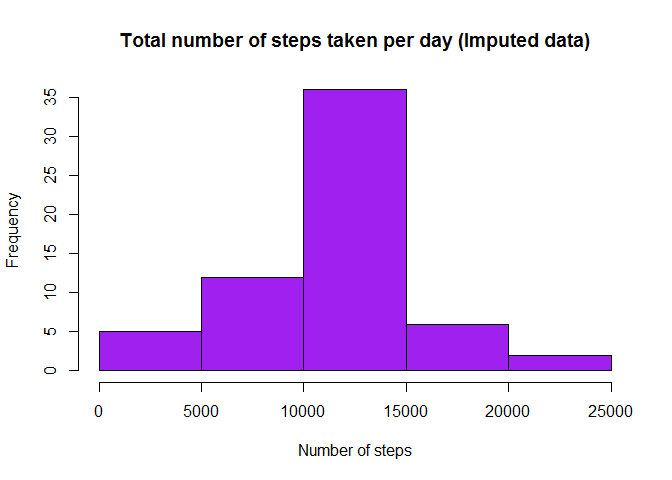
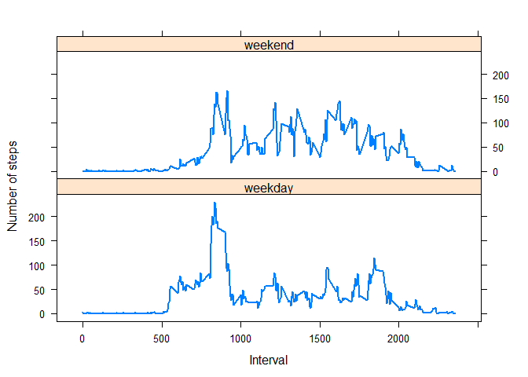

```r
library(knitr)
opts_chunk$set(dev="png")
```

## Loading and preprocessing the data

**1. Loading the data**


```r
if (!file.exists('activity.csv')) {
    unzip(zipfile = "activity.zip")
}
activitydata <- read.csv("activity.csv")
```

**2. Transforming data as required**

```r
activitydata$date <- as.POSIXct(activitydata$date, format = "%Y-%m-%d")
```

## Histogram of total number of steps taken each day.


```r
stepsperday <- aggregate(steps ~ date, activitydata, FUN = sum)
hist(stepsperday$steps, col = "gray", xlab = "Number of steps", ylab = "Frequency", main = "Total number of steps taken per day")
```

<!-- -->

```r
stepsmean <- mean(stepsperday$steps, na.rm = TRUE)
stepsmedian <- median(stepsperday$steps, na.rm = TRUE)
```

**Mean** of the total number of steps taken per day: **1.0766189\times 10^{4}.**

**Median** of the total number of steps taken per day: **10765.**

## Time series plot


```r
avgstepsperday <- aggregate(steps ~ interval, activitydata, FUN = mean)
plot(avgstepsperday$interval, avgstepsperday$steps, type = "l", col = "Brown", lwd = 2, xlab = "5-minute intervals", ylab = "Average number of steps", main = "Average daily activity pattern")
```

<!-- -->

```r
maxstepsinterval <- avgstepsperday$interval[which.max(avgstepsperday$steps)]
```

On an average most steps were taken at interval **835**


## Imputing missing values


```r
totalNAs <- sum(is.na(activitydata))
```

Total number of missing values in the dataset is **2304**

**Imputed Data**


```r
imp_activitydata <- activitydata
imp_activitydata$steps[is.na(imp_activitydata$steps)] = avgstepsperday$steps[match(avgstepsperday$interval, imp_activitydata$interval)]
head(imp_activitydata)
```

```
##       steps       date interval
## 1 1.7169811 2012-10-01        0
## 2 0.3396226 2012-10-01        5
## 3 0.1320755 2012-10-01       10
## 4 0.1509434 2012-10-01       15
## 5 0.0754717 2012-10-01       20
## 6 2.0943396 2012-10-01       25
```


```r
imp_stepsperday <- aggregate(steps ~ date, imp_activitydata, FUN = sum)
hist(imp_stepsperday$steps, col = "purple", xlab = "Number of steps", ylab = "Frequency", main = "Total number of steps taken per day (Imputed data)")
```

<!-- -->

```r
imp_stepsmean <- mean(imp_stepsperday$steps, na.rm = TRUE)
imp_stepsmedian <- median(imp_stepsperday$steps, na.rm = TRUE)
```

**Mean** of the total number of steps taken per day (Imputed data): **1.0766189\times 10^{4}.**

**Median** of the total number of steps taken per day (Imputed data): **1.0766189\times 10^{4}.**


**The only change observed between the two histograms for raw data and imputed data is the increase in frequency where 10000 to 15000 steps occured.**


## Differences in activity patterns between weekdays and weekends


```r
library(dplyr)
```

```
## 
## Attaching package: 'dplyr'
```

```
## The following objects are masked from 'package:stats':
## 
##     filter, lag
```

```
## The following objects are masked from 'package:base':
## 
##     intersect, setdiff, setequal, union
```

```r
library(lattice)
week_activitydata <- imp_activitydata %>%
    mutate(day = weekdays(date)) %>%
    mutate(daytype = ifelse(day %in% c("Saturday","Sunday"), "weekend", "weekday"))
week_stepsperday <- aggregate(steps ~ interval + daytype, week_activitydata, FUN = mean)
xyplot(steps ~ interval | daytype, week_stepsperday, type="l", lwd=2, xlab="Interval", ylab="Number of steps", layout=c(1,2))
```

<!-- -->
